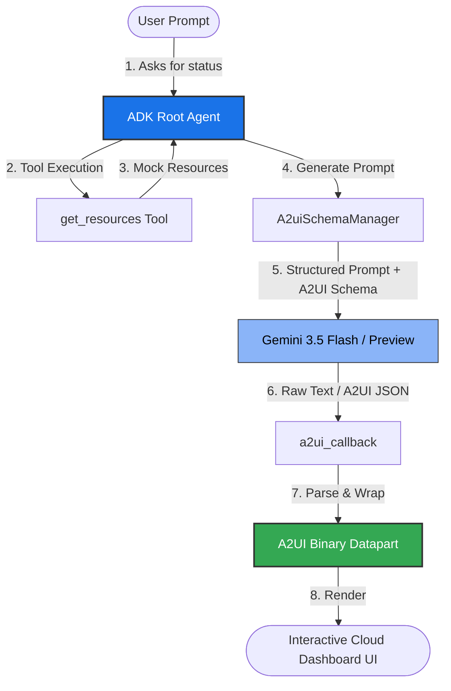

# 🌌 build-adk-a2ui-frontend

Bring agentic apps to life. This project pairs the **Agent Development Kit (ADK)** with **A2UI** to replace plain text responses with dynamic, native interfaces. It utilizes declarative UI primitives to let your agent dynamically compose rich, interactive layouts on the fly—with zero additional frontend development required.

This repository implements a **Cloud Infrastructure Assistant** that can inspect cloud resources and display a beautifully formatted, structured dashboard (featuring status indicators, rows, columns, and metric cards) instead of plain-text code logs or lists.

---

## 🏗️ System Architecture & Workflow

The following diagram illustrates how the user's request is processed by the agent, enhanced by the A2UI Schema Manager, and finally transformed into a rich UI payload:



---

## 🔄 Core Workflow: Step-by-Step

Here is the step-by-step lifecycle of a request:

1. **User Request**: The user asks about cloud resources (e.g., *"Show me the status of our services"*).
2. **Context Retrieval**: The agent calls the `get_resources` tool, retrieving a JSON list of mock Google Cloud services (including region, memory, CPU, status, and any active warnings/errors).
3. **Structured Prompt Generation**: The `A2uiSchemaManager` compiles a robust system instruction detailing the exact schema and examples of A2UI messages (`beginRendering`, `surfaceUpdate`, etc.).
4. **LLM Inference**: The model evaluates the cloud resources data and outputs a list of declarative UI directives (e.g., Cards, Rows, Columns, Text, and Status Icons).
5. **Callback Post-processing**: The `a2ui_callback` interceptor extracts the JSON payload from the raw LLM text, wraps it inside special binary `<a2a_datapart_json>` tags, and produces a rendered data component.
6. **Dynamic Rendering**: The frontend parses the binary datapart to display a native, reactive dashboard.

---

## 📁 File Structure

- 📂 `a2ui_agent/`
  - 📄 `agent.py` — Defines the `A2uiSchemaManager`, system instructions, and the main ADK `Agent` instance.
  - 📄 `resources.py` — Houses mock cloud resource metadata and the `get_resources()` tool.
  - 📄 `a2ui_utils.py` — Formats and structures raw JSON into renderable binary A2UI dataparts via `a2ui_callback`.
  - 📄 `.gitignore` — Filters out Python cache (`__pycache__`), virtualenvs, and session databases.
  - 📄 `README.md` — Project overview and workflow documentation.

---

## 🛠️ How to Run and Use

### 1. Prerequisites
Make sure you have Python 3.10+ installed along with the required Google GenAI and ADK libraries.
```bash
pip install google-genai google-adk a2ui
```

### 2. Run the Agent
The agent can be imported and executed within your ADK-enabled chat environment or test harness:
```python
from a2ui_agent.agent import root_agent

response = root_agent.chat("Show me the current state of our services.")
# The returned response will contain the specialized binary A2UI components
```

---

## 🎨 Supported UI Primitives
Using the `A2uiSchemaManager`, the agent utilizes a rich suite of layout and presentation blocks:
- **Layouts**: Rows, Columns, Cards
- **Displays**: Text, Titles, Status Indicators (Healthy 🟢, Warning 🟡, Error 🔴)
- **Actions**: Buttons and Interactive Drilldowns
